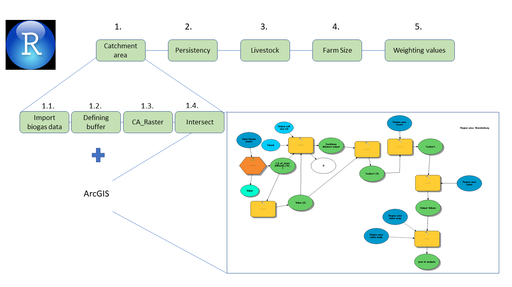
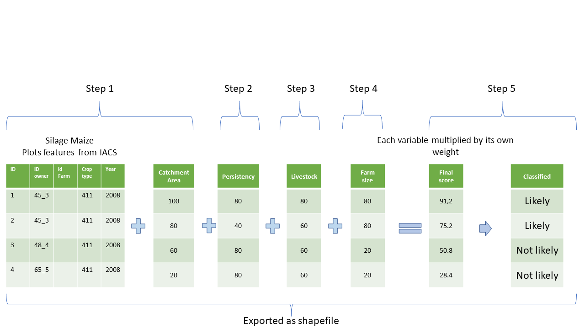

# Biogas_silage_maize

Here it is presented the scripts that were used to calculate the likelihood of silage maize for biogas production.

## Steps
1.  Calculation of the catchment area  
    * 1.1.- Import Biogas plants data. This dataset was previously processed, identifying biogas complex and filtering the biogas satellite plants.  
Run Import_biogas_data.R  
    * 1.2.- Definition of the buffer through the radius  
Run Defining_buffer.R  
Result is a point layer containing the biogas plants with a field indicating the radius for the catchment area. This is processed to calculate the euclidean distance (formula (d) in article) in Arcgis, using the toolbox Euclidean Distance Biogas presented in this repository.   
The application in Arcgis is **highly demanding**. the first year can take 1 hour and a half and the last one 5 hours, depending on the hardware capabilities.  
      * 1.2.1.-First must be filtered the biogas plants for each year  
      * 1.2.2.- It is applied the toolbox "Euclidean Distance Biogas", tool "Catchment area process" open as edit.  
      * 1.2.3.-  
Parameters:  
Input biogas plant: biogas plant point layer.  
Iterate by FID_1, which is the ID.  
Get field value: "r", which is the radius field.  
Output cell size: 90x90  
Region area vector: Brandenburg polygon layer  
After getting the value of 1 year, it must be selected the next year from the biogas point layer and restart process until all the years were processed. It is recommended to delete all the preprocessing data and just leaving the final result saved as 2011, 2012,...,2018, before starting again.  
Finally, it is obtained 11 Raster layers which are imported in the next step.  
    * 1.3.- Reclassification and Poligonization of results step 2.1; Dissolve of features with equal score  
Run CA_Raster.R  
    * 1.4.- Intersect values of catchment area with silage maize plots  
Run Intersect.R  
First, it is imported the silage maize plots from IACS layers. Therefore they were identified through their codes and organized according to their years.
Secondly, it is imported the polygons froms step 2.2 and it is done the intersection. 
As a result, it is obtained the silage maize plots with the corresponding catchment area score. 

2.  Calculation of the persistency score.  
Run persistency.R 
[Persistency](../persistency.R)
[a relative link](persistency.R)
3.  Calculation of the livestock score.  
Run livestock.R 

4.  Calculation of the Farm size score.  
Run Farm_size.R 

5.  Final Score  
Run weighting_values.R  
Example of the procedure:  

